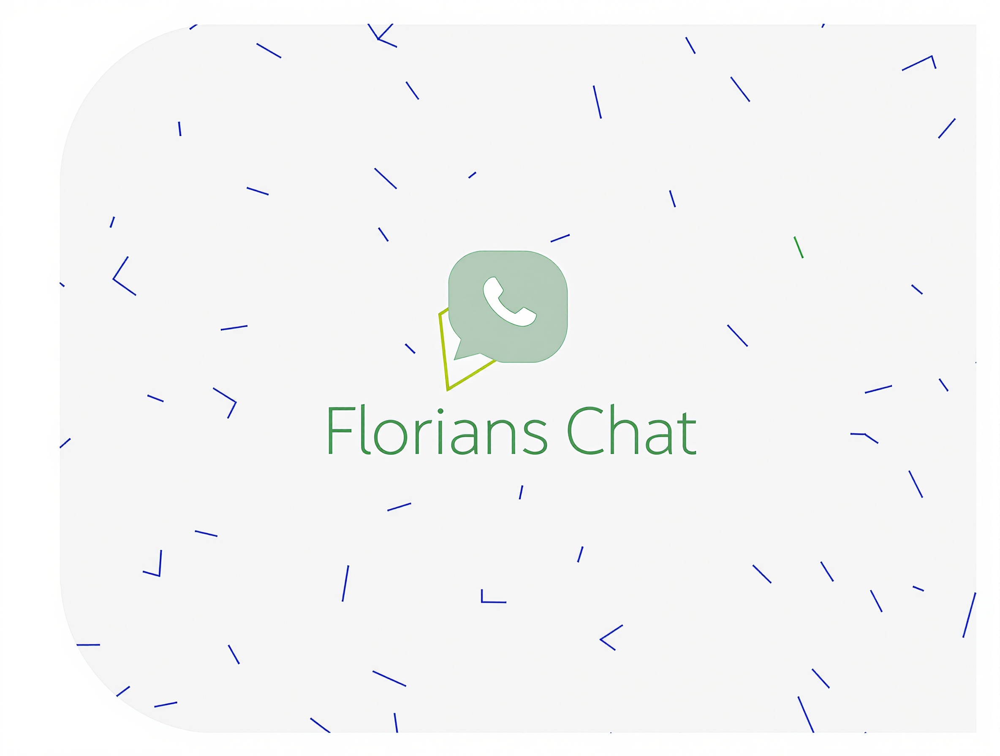
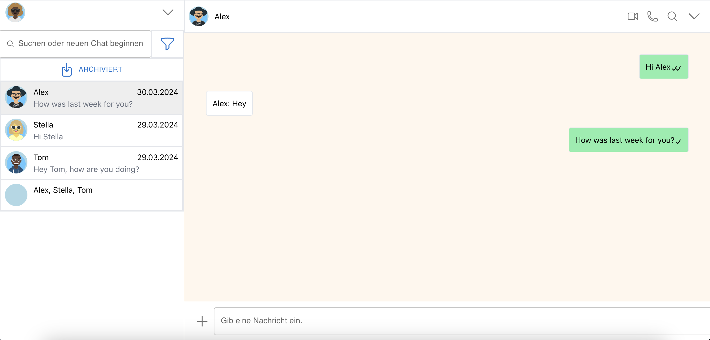

# Florian's Chat - Real-Time Messaging App


[](#)


A WhatsApp-style real-time chat application featuring video/voice calls, group messaging, and end-to-end type safety between frontend and backend.



## Architecture Overview

```
┌─────────────────┐         ┌─────────────────┐         ┌─────────────────┐
│     React       │  REST   │     NestJS      │         │    MongoDB      │
│    Frontend     │────────▶│     Backend     │────────▶│    (Mongoose)   │
│   (Vite/MUI)    │◀────────│   (TypeScript)  │         └─────────────────┘
└─────────────────┘         └─────────────────┘
        │                           │                   ┌─────────────────┐
        │      Socket.io            │──────────────────▶│     Redis       │
        └───────────────────────────┘                   │  (WebSocket     │
        │                           │                   │   scaling)      │
        │         WebRTC            │                   └─────────────────┘
        └──────────┬────────────────┘
                   ▼                                    ┌─────────────────┐
          ┌─────────────────┐                           │       S3        │
          │    PeerJS +     │                           │  (File storage) │
          │  Coturn (TURN)  │                           └─────────────────┘
          └─────────────────┘
```

## Tech Stack

### Frontend
- **React 19** with TypeScript and functional components
- **MUI** component library + **Tailwind CSS** for styling
- **Vite** for fast development and optimized builds
- **Socket.io client** for real-time bidirectional communication
- **PeerJS** for WebRTC video/voice calls
- **typesafe-i18n** for internationalization
- Responsive design for mobile and desktop

### Backend
- **NestJS** framework with TypeScript
- **MongoDB** with Mongoose ODM for data persistence
- **Redis** adapter for horizontally scalable WebSocket connections
- **S3** compatible storage for images and audio messages
- **JWT** authentication with secure HTTP-only cookies
- **Bcrypt** password hashing
- Custom **PeerJS server** fork with pub/sub functionality

### API Design
- **ts-rest** for type-safe API contracts between frontend and backend
- **Zod** schema validation with types shared across the stack
- RESTful endpoints with full TypeScript type inference
- WebSocket events for real-time message delivery and read receipts

### DevOps & Infrastructure
- **Docker** containerization with multi-stage builds
- **GitHub Actions** CI/CD pipeline for automated deployments
- **Google Kubernetes Engine (GKE)** for container orchestration
- **Helm charts** for declarative Kubernetes deployments:
  - Main application chart with configurable values
  - MongoDB subchart
  - Redis subchart
  - S3Mock subchart for local development
  - Coturn TURN server subchart for WebRTC connectivity
  - Loki + Grafana chart for centralized logging and monitoring
  - GlitchTip chart for error tracking
- **Google Artifact Registry** for Docker image storage

## Features

- User registration, login, and logout with secure password hashing
- Add contacts and send direct messages
- Create group chats with multiple participants
- Real-time message delivery and read receipts
- User profile editing and viewing
- Image sharing
- Audio message recording and playback
- Video and voice calls via WebRTC
- Real-time online status indicators
- Chat cleanup and deletion

## Key Technical Decisions

| Challenge | Solution |
|-----------|----------|
| Scalable WebSockets | Redis pub/sub adapter enables horizontal scaling across multiple backend instances |
| Type-safe API | ts-rest contracts with Zod ensure frontend/backend type consistency at compile time |
| Video calls behind NAT | Self-hosted Coturn TURN server deployed via Helm for reliable WebRTC connectivity |
| File handling | S3-compatible storage with secure access for scalable file uploads |
| Kubernetes deployment | Helm charts with subcharts for modular, reproducible infrastructure |
| Observability | Loki + Grafana stack for centralized logging across all services |

## CI/CD Pipeline

The project uses GitHub Actions for continuous deployment:

1. **Trigger**: Pipeline runs on tagged commits
2. **Build**: Docker image built with Vite environment variables
3. **Push**: Image pushed to Google Artifact Registry with version tag
4. **Deploy**: Automatic deployment to GKE cluster via kubectl patch

See [`.github/workflows/release.yaml`](.github/workflows/release.yaml) for the full pipeline.

## Helm Charts

The `helm/` directory contains multiple charts for deploying the entire stack:

```
helm/
├── realtime-chat/       # Main application
│   ├── charts/
│   │   ├── coturn/      # TURN server for WebRTC
│   │   ├── mongodb/     # Database
│   │   ├── redis/       # WebSocket scaling
│   │   └── s3mock/      # Local S3 emulation
│   └── values.yaml
├── loki-grafana/        # Logging and monitoring
└── glitchtip/           # Error tracking
```


-