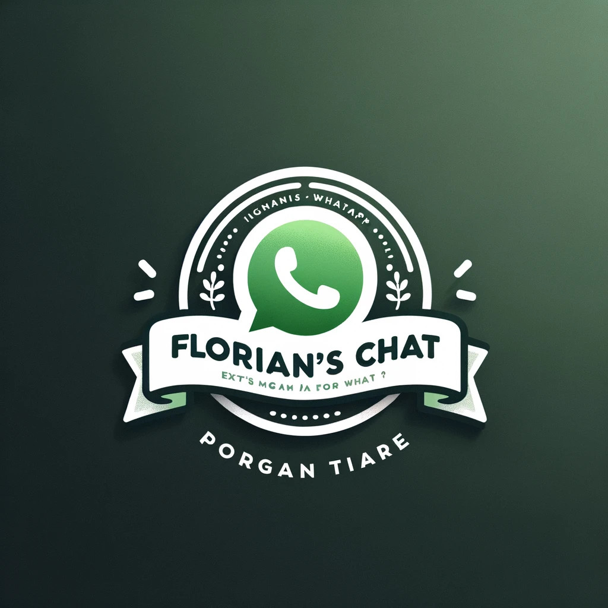

## Florian's Chat (Real-Time Chat App - What's App style)

### Functionality

Right now users can...
* register, log in, log out, passwords being hashed with Bcrypt.
* add other users as contacts and write them messages.
* create chat groups with multiple users and exchange messages.
* clean up or delete chats.
* receive messages and see if they have been read in real time.

### Technical Details

The backend...
* is written in TypeScript making use of NestJS as a framework.
* talks via mongoose to a MongoDb cluster for data persistence.
* serves the frontend as well

The frontend...
* is also written in TypeScript making use of React v18 as a framework.
* uses the MUI material library components.
* uses Tailwind CSS as a style library.
* offers responsiveness to run on phone and web
* is compiled with Vite for a fast development speed.

Backend and frontend...
* are secured via JWTs
* communicate via REST with typesafe communication via ts-rest, a tRPC like communications contract between frontend and backend.
* are processing real time updates with WebSocket connections via socket.io server and client.

### Next TODOs
* Implement sending of files in chat
* Check JWTs for expiration
